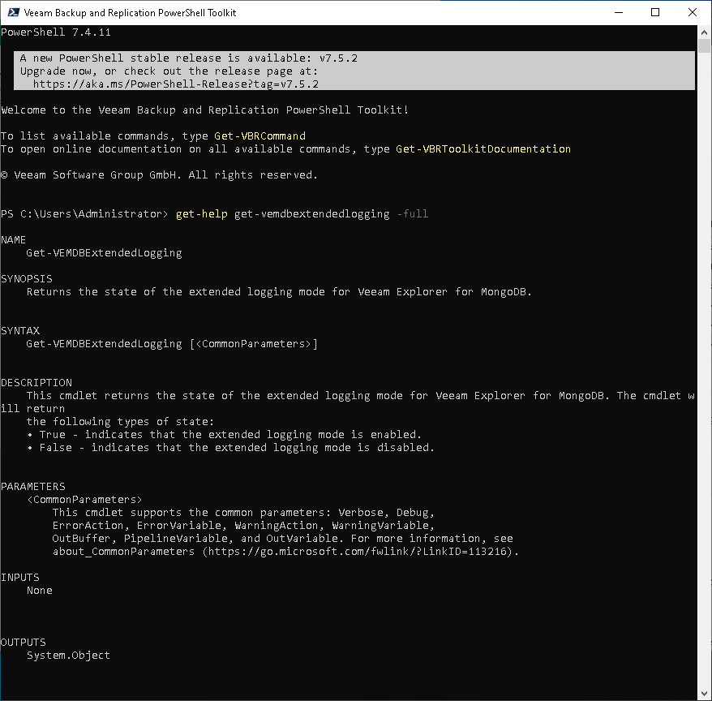

# Using Get-Help

Using Get-Help

The Get-Help cmdlet is a Microsoft cmdlet. You can use this cmdlet to get information on Microsoft cmdlets, as well as on cmdlets added with Veeam Explorers PowerShell modules.

To get full details about the necessary cmdlet, run the Get-Help <cmdletname> -full command from your PowerShell console. The Get-Help command will return a whole set of parameters that are available for the cmdlet and an input type for each parameter.

|  |
| --- |
| Note |
| The online help for PowerShell on [Veeam Help Center](https://www.veeam.com/documentation-guides-datasheets.html) always provides more accurate information than the help reference that is integrated into the product. The online help is updated regularly and contains all fixes based on customers feedback. |

