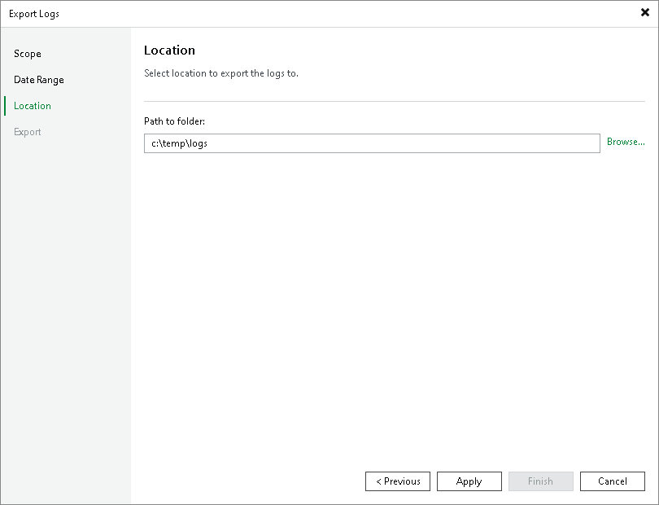

# Step 4. Specify Destination Folder

In this article

At the Location step of the wizard, specify the destination folder to which the logs will be exported.

In the Path to folder field, specify a path to an archive with log files that will be created. By default, the archive is placed to the C:\temp\logs folder on the backup server.

Page updated 9/23/2025

Page content applies to build 13.0.1.1071
