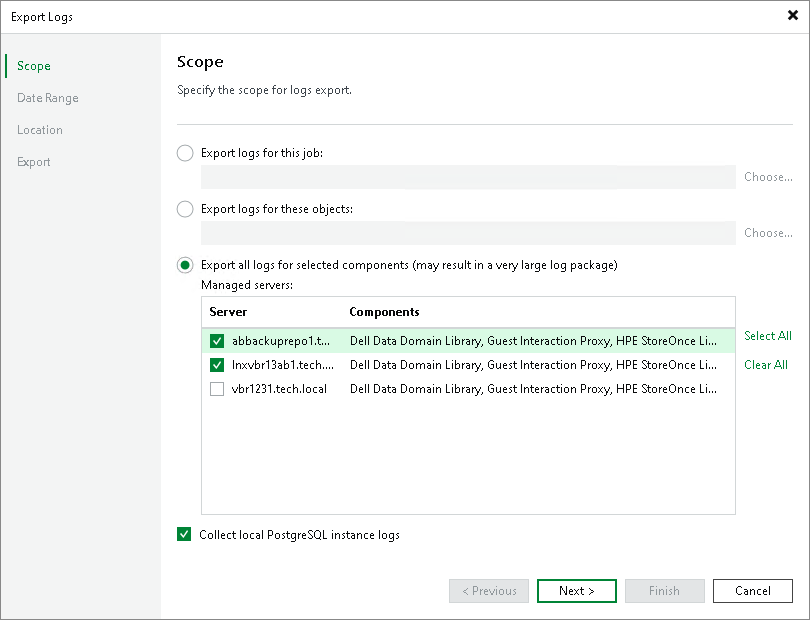

# Step 2. Select Virtual Infrastructure Scope

At the Scope step of the wizard, define the scope for logs export. You can export logs for the following objects:

* Specific jobs on the backup server.
* Specific objects (VMs, physical machines, CDP clusters, backups, scale-out backup repositories).
* Specific components in the backup infrastructure.

Select Collect local PostgreSQL instance logs to include PostgreSQL instance logs into the log archive that you may provide to [Veeam Customer Support](https://www.veeam.com/support.html). The logs will contain information about all databases contained on the selected instance.

|  |
| --- |
| Note |
| If you export logs from the Veeam Backup & Replication console, the exported logs will be copied to the machine where the console is installed. The log archive will also contain logs from the console machine. |

|  |
| --- |
| Tip |
| To select multiple jobs or objects in one bundle, do one of the following:   * Hold [Ctrl] and click items to add to your selection. * Hold [Shift] and select a range of items between the currently selected item and the one you click. |

