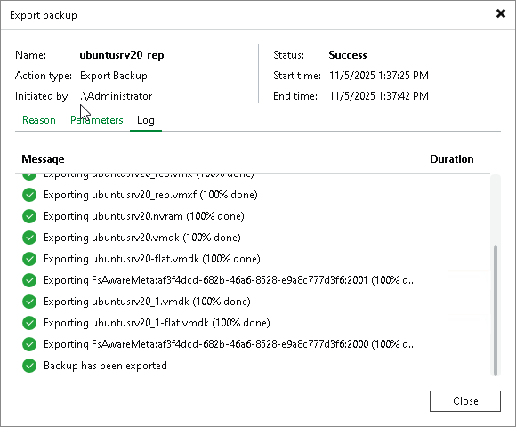
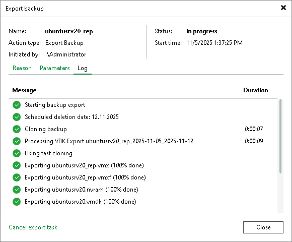

# Viewing Session Statistics

In this article

Once you invoke the export procedure, Veeam shows the Export backup progress dialog box that informs you of the current export status.

You can close the dialog box by clicking the Close button in the lower-right corner and let Veeam perform export in the background.

As each export session saves its results to the configuration database, you can review them at any time.

To review the export session results, do the following:

1. In the [inventory pane](vbr_ui.md), go to the History view and select the Restore node.
2. In the working area, double-click a machine for which you want to review the session results or right-click a machine and select Statistics.

The Export backup dialog box contains the following tabs:

* The Reason tab — shows you the reason for export you may have provided at the [Specify Export Reason](specify_export_reason.md) step of the wizard.
* The Parameters tab — shows you the date when the exported backup files will be removed due to the retention policy you may have configured at the [Select Restore Points to Export](specify_restore_points_to_export.md) step of the wizard. In this tab, you can also find a backup name and Date/time of a restore point that was synthesized into a full backup file.
* The Log tab — shows you the actual export progress.

Canceling Session

To cancel a session, open the Export backup dialog box, as described in steps 1–2 above, and click Cancel restore task in the upper-right corner of the dialog box.

Page updated 7/4/2025

Page content applies to build 13.0.1.1071
