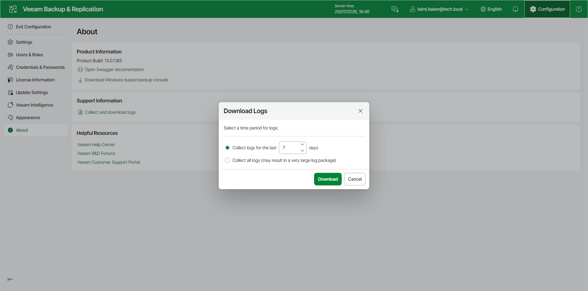

# Exporting Logs Using Web UI

To collect all log files in the same location, do the following in the Veeam Backup & Replication web UI:

1. Click the Configuration button in the top bar.
2. In the management pane, click About > Collect and download logs.
3. In the Download Logs window, specify the time period for which logs must be collected. You can select one of the following options:

* Collect logs for the last N days
* Collect all logs

1. Click Download. Logs will be downloaded to the folder that is set in the browser.
2. Wait for the download process to complete. Open the folder that contains the downloaded log files.

|  |
| --- |
| Note |
| To collect logs about the Veeam Software Appliance, collect logs as described in section [Exporting Logs Using Console](exporting_logs_console.md). |

