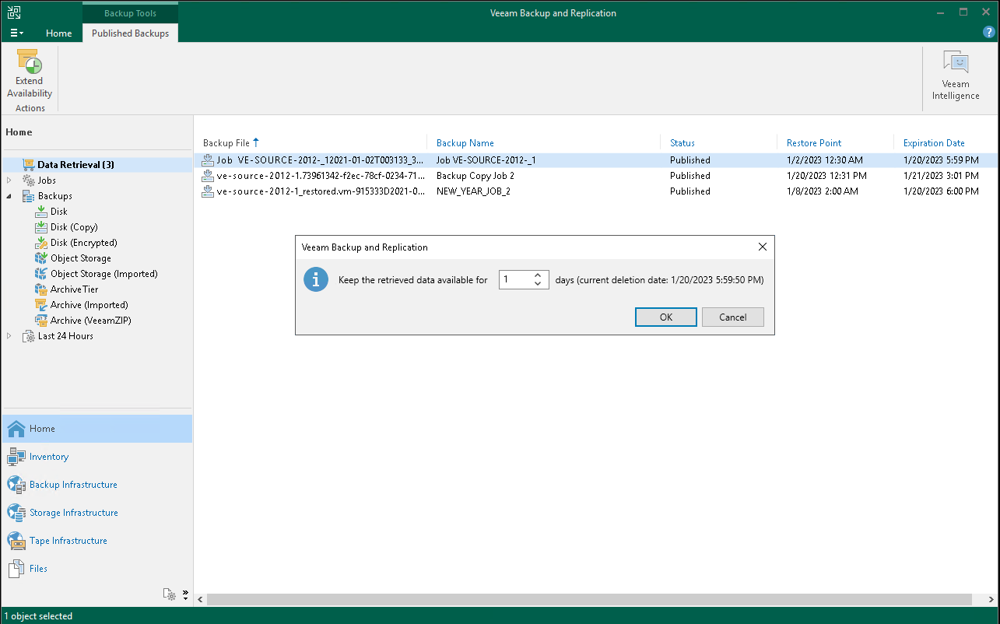

# Extending Data Availability

In this article

The availability period of the retrieved data can be prolonged:

* Manually. If the retrieval job still continues at the moment of manual extension, the new extension time is automatically added to the job.
* Automatically. This happens in cases when the expiration time is close, but the restore process still continues.

At the [Select Availability Period](archive_retrieval_availability.md) step of the Retrieve Backup wizard, you can request a notification that the data availability is about to expire. If you extend the expiration time, the notification will be postponed according to the expiration time.

To extend the availability period, do the following:

* Open the Home view. In the inventory pane select Data Retrieval. In the working area, select the retrieved backup file whose availability period you want to extend, and click Extend Availability on the ribbon. You will be prompted to select the number of days you want to add to the availability expiration time.

* Open the Home view. In the inventory pane select Archive Tier. In the working area, select the backup job for whose retrieved files you want to extend availability and click Properties on the ribbon. In the Backup Properties window, click on Extend Availability Period. You will be prompted to select the number of days you want to add to current expiration time.

Page updated 5/29/2024

Page content applies to build 13.0.1.1071
