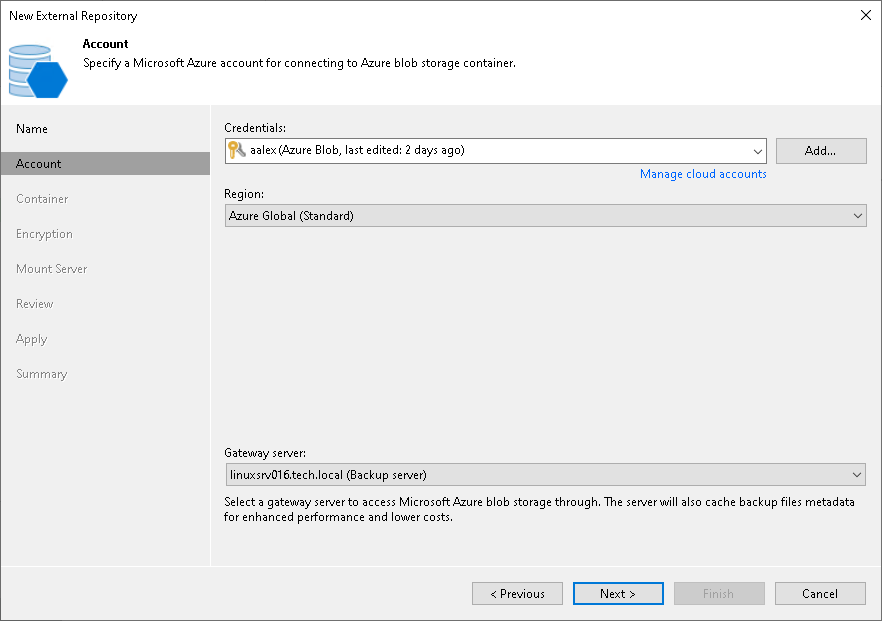

# Step 3. Specify Cloud Storage Account

In this article

At the Account step of the wizard, specify settings for an account which will be used to connect to Azure Blob storage:

1. From the Credentials drop-down list, select user credentials to access your Azure Blob storage.

If you have not set up credentials beforehand in the [Cloud Credentials Manager](cloud_credentials.md), click the Manage cloud accounts link or click Add on the right to add the necessary credentials.

1. From the Region drop-down list, select the region type.
2. From the Gateway server drop-down list, select a gateway server that will be used to access Azure Blob storage. We recommend that you use a gateway server, for example, if your organization has NAT or different types of firewalls and your access to the internet is limited.

The gateway server caches data when you [copy backups](backup_copy.md) or perform restore operations. The gateway server helps you decrease the amount of traffic being sent over the network and reduce data transfer costs. For more information on caching data, see [Cache](external_repository_cache.md).

By default, the role of a gateway server is assigned to the Veeam Backup & Replication server. If the Veeam Backup & Replication server resides in a region that differs from the Azure region where your Blob storage resides, choose a server that is located close to the storage. You can choose any Microsoft Windows or Linux server that is added to your Veeam Backup & Replication infrastructure and has internet connection. Note that the server must be added to the infrastructure beforehand. For more information on how to add a server, see the [Adding Microsoft Windows Servers](add_windows_server.md) and [Adding Linux Servers](add_linux_server.md) sections.

|  |
| --- |
| Note |
| Consider the following:   * On the gateway server, Veeam Backup & Replication deploys [Veeam Data Mover](veeam_transport_service.md) that handles traffic sent when you work with external repository data. If Veeam Data Mover becomes outdated, you must upgrade it as described in section [Upgrading External Repositories](upgrading_external_repositories.md). * If you choose not to use a gateway server, make sure that all scale-out repository extents have direct internet access. |

Page updated 8/26/2025

Page content applies to build 13.0.1.1071
