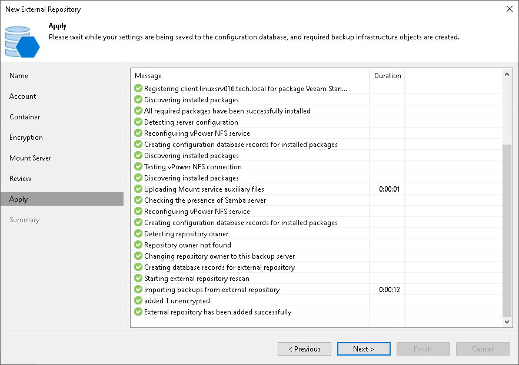

# Step 8. Apply Settings

In this article

At the Apply step of the wizard, wait for Veeam Backup & Replication to install and configure all required components. Then click Next to complete the procedure of adding the external repository to the backup infrastructure.

Page updated 7/11/2025

Page content applies to build 13.0.1.1071
