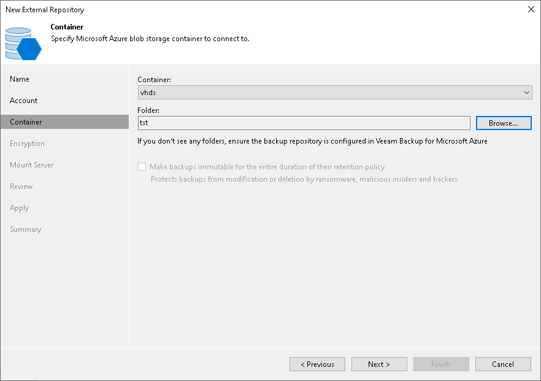

# Step 4. Select Azure Blob Container

At the Container step of the wizard, specify Azure Blob storage container settings:

1. From the Container drop-down list, select a container that contains backups created by [Veeam Backup for Microsoft Azure](https://helpcenter.veeam.com/docs/vbazure/guide/overview.html?ver=8.1).
2. Click Browse to select a folder that contains backups created by Veeam Backup for Microsoft Azure.

If you do not see the required folder, make sure that the repository you are trying to add is created on the Veeam Backup for Microsoft Azure server.

|  |
| --- |
| Note |
| Consider the following:   * Only Hot and Cool access tiers are supported. * If another Veeam Backup & Replication client has already added the same folder, you will be prompted whether to reclaim ownership of such a folder. For more information about ownership, see [Ownership](external_repository_ownership.md). |

