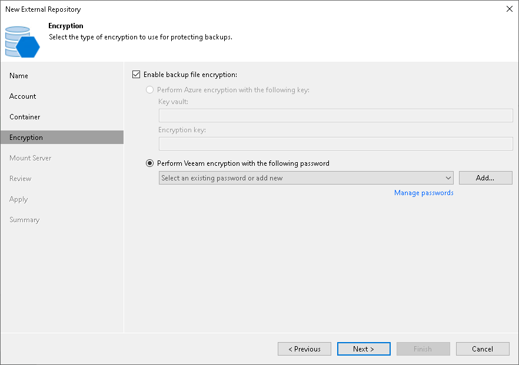

# Step 5. Configure Encryption

In this article

At the Encryption step of the wizard, provide a key for decryption:

* If data in the external repository is encrypted with a [Key Vault key](https://docs.microsoft.com/en-us/azure/key-vault/general/about-keys-secrets-certificates), Veeam Backup & Replication shows the used Key Vault and encryption key. In this case, Veeam Backup & Replication will automatically decrypt the backups.

|  |
| --- |
| Note |
| The cloud account you specified at the Account step of the wizard, must have access to Key Vault keys. For more information about Key Vault key permissions, see the [Service Account Permissions](https://helpcenter.veeam.com/docs/vbazure/guide/service_account_permissions.html?ver=8.1) section in the Veeam Backup for Microsoft Azure Guide. |

* If data in the external repository is encrypted with a password, select Enable backup file encryption and then click Perform Veeam encryption with the following password. From the drop-down list, select the password that must be used to decrypt the data. If the password is correct, Veeam Backup & Replication will automatically decrypt the backups.

If you have not added the password beforehand, click the Manage passwords link or the Add button to add the necessary password. For more information on adding passwords, see [Creating Passwords](password_manager_create.md).

If you do not specify the decryption password, you can do it later. For more information, see [Viewing External Repository Data](viewing_external_repository_data.md).

Page updated 10/2/2024

Page content applies to build 13.0.1.1071
