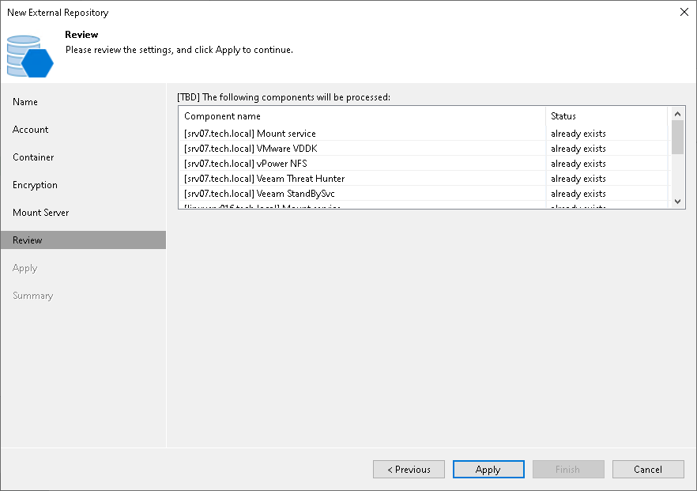

# Step 7. Review Properties and Components

In this article

At the Review step of the wizard, review the list of components that will be installed on the external repository.

Page updated 7/11/2025

Page content applies to build 13.0.1.1071
