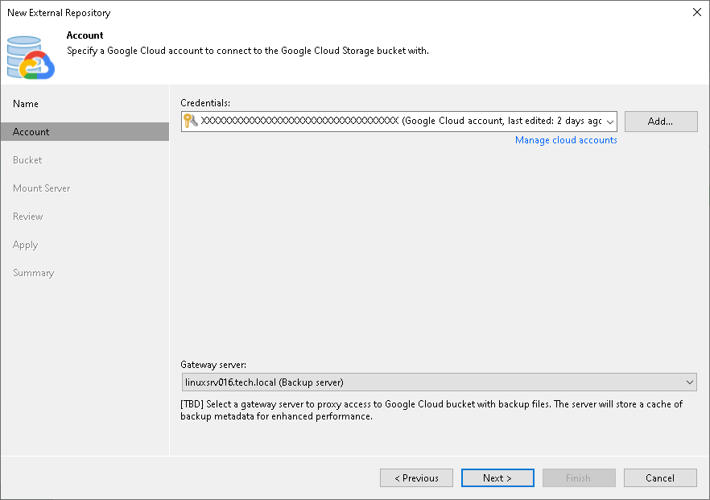

# Step 3. Specify Cloud Storage Account

In this article

At the Account step of the wizard, specify Google Cloud connection settings:

1. From the Credentials drop-down list, select user credentials to access a storage bucket with the backups.

If you have not set up credentials beforehand, click the Manage cloud accounts link or click Add on the right and add the necessary credentials, as described in section [Google Cloud Accounts](cloud_credentials_google.md) .

1. From the Gateway server drop-down list, select a server that will be used to access the Google Cloud storage.

You can select any Microsoft Windows or Linux server that is added to your backup infrastructure and has internet connection. You may want to use a gateway server, for example, if your organization has NAT or different types of firewalls and your access to the internet is limited. For more information on how to add such a server to your environment, see [Adding Microsoft Windows Servers](add_windows_server.md) and [Adding Linux Servers](add_linux_server.md). By default, the role of a gateway server is assigned to the machine where Veeam Backup & Replication is installed.

On the gateway server, Veeam Backup & Replication deploys [Veeam Data Mover](veeam_transport_service.md). Veeam Data Mover is responsible for handling ingress/egress requests that are sent to/from the gateway server when you work with the external repository data in Veeam Backup & Replication. If Veeam Data Mover becomes outdated, you must upgrade it as described in section [Upgrading External Repositories](upgrading_external_repositories.md).

Gateway servers store cached data. For more information, see [Cache](external_repository_cache.md).

Page updated 8/26/2025

Page content applies to build 13.0.1.1071
