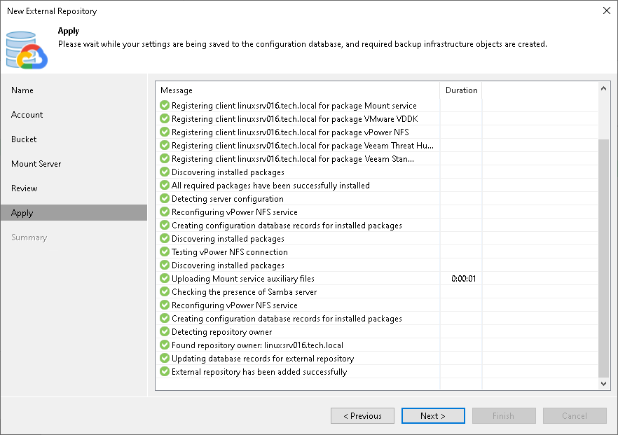

# Step 7. Apply Settings

In this article

At the Apply step of the wizard, wait until Veeam Backup & Replication applies settings and completes adding the external repository. Then click Next.

Related Topics

[Viewing External Repository Data](viewing_external_repository_data.md)

Page updated 7/11/2025

Page content applies to build 13.0.1.1071
