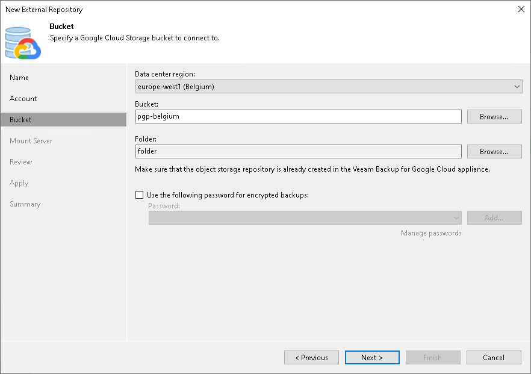

# Step 4. Specify Cloud Storage Details

In this article

At the Bucket step of the wizard, specify a Google Cloud bucket and folder where Google Cloud instance backups reside:

1. From the Data center region drop-down list, select a region.
2. Next to the Bucket field, click Browse and select a bucket.
3. In the Select Folder field, select a cloud folder where the data will be stored. To do it, click Browse and select an existing folder.
4. If the folder contains encrypted backups, select the Use this password for encrypted backups check box and provide a password. If you skip this step for encrypted backups, Veeam Backup & Replication will add such backups to the External Repository (Encrypted) node. For more information, see [Viewing External Repository Data](viewing_external_repository_data.md).

For more information about encryption, see [Encryption](external_repository_encryption.md).

|  |
| --- |
| Note |
| Consider the following:   * Only Standard storage class is supported. * If another Veeam Backup & Replication client has already added the same folder, you will be prompted whether to reclaim ownership of such a folder. For more information about ownership, see [Ownership](external_repository_ownership.md). |

Page updated 6/14/2024

Page content applies to build 13.0.1.1071
