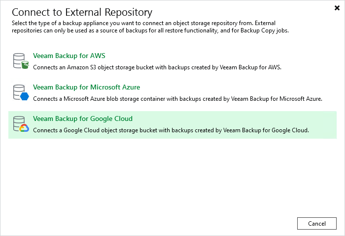

# Step 1. Launch New External Repository Wizard

In this article

To launch the New External Repository wizard, do one of the following:

* Open the Backup Infrastructure view. In the [inventory pane](vbr_ui.md) select the External Repositories node and click Connect to Repository on the ribbon. At the Connect to External Repository window, select Veeam Backup for Google Cloud.
* Open the Backup Infrastructure view. In the [inventory pane](vbr_ui.md) right-click the External Repositories node and select Connect to... At the Connect to External Repository window, select Veeam Backup for Google Cloud.

Page updated 12/21/2023

Page content applies to build 13.0.1.1071
