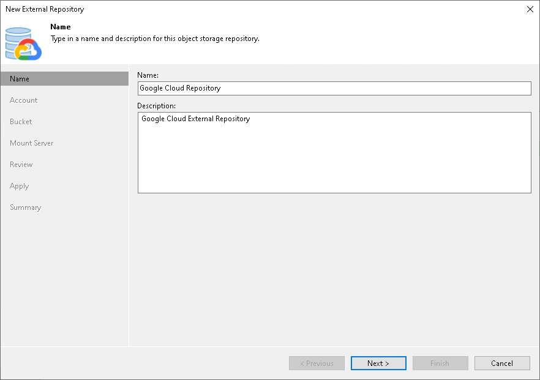

# Step 2. Specify External Repository Name

At the Name step of the wizard, specify a name and description for the external repository.

1. In the Name field, enter a name for the external repository.
2. In the Description field, enter an optional description.

The default description contains information about the user who added the external repository, date and time when the external repository was added.

