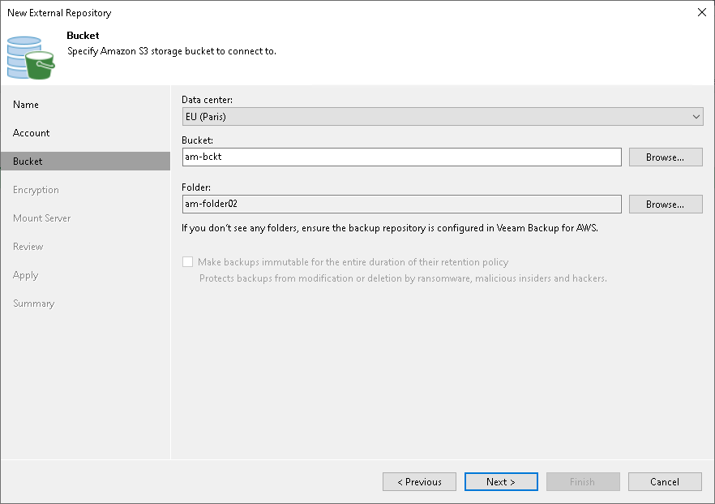

# Step 4. Specify Cloud Storage Details

In this article

At the Bucket step of the wizard, specify an Amazon S3 bucket and folder where Amazon EC2 instance backups reside:

1. From the Data center drop-down list, select an AWS region where the Amazon S3 bucket is located.
2. From the Bucket drop-down list, select the necessary Amazon S3 bucket where EC2 instance backups reside.
3. Click Browse to select a folder in the Amazon S3 bucket where EC2 instance backups reside.

If you do not see the required folder, make sure that the repository you are trying to add is created on the [Veeam Backup for AWS](https://helpcenter.veeam.com/docs/vbaws/guide/overview.html?ver=10) server.

|  |
| --- |
| Note |
| Consider the following:   * Only Standard storage class is supported. * If another Veeam Backup & Replication client has already added the same folder, you will be prompted whether to reclaim ownership of such a folder. For more information about ownership, see [Ownership](external_repository_ownership.md). |

Page updated 6/14/2024

Page content applies to build 13.0.1.1071
