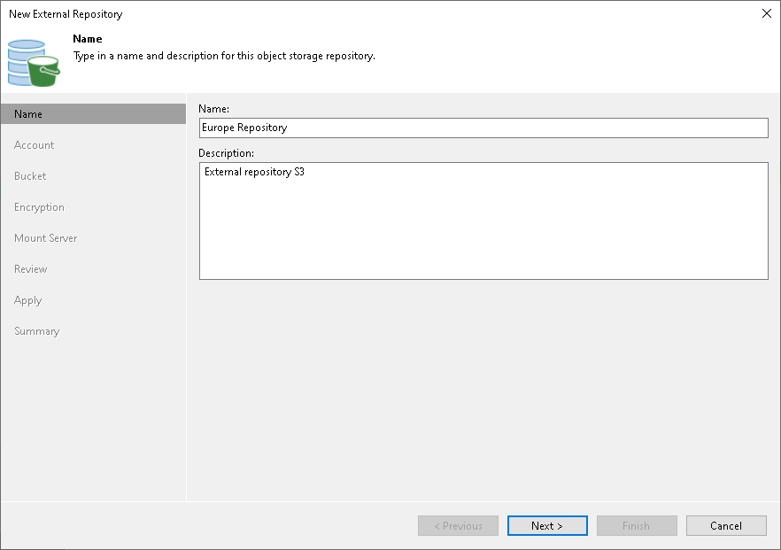

# Step 2. Specify External Repository Name

In this article

At the Name step of the wizard, specify a name and description for the external repository.

Page updated 6/14/2024

Page content applies to build 13.0.1.1071
