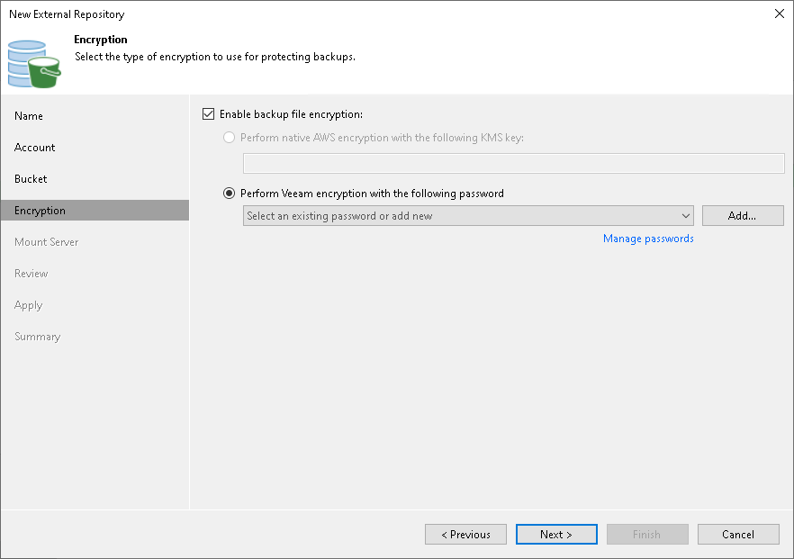

# Step 5. Configure Encryption

In this article

At the Encryption step of the wizard, provide a key for decryption:

* If data in the external repository is encrypted with a key management service (KMS) [customer managed key](https://docs.aws.amazon.com/kms/latest/developerguide/concepts.html#master_keys) (CMK), Veeam Backup & Replication shows the used key. In this case, Veeam Backup & Replication will automatically decrypt the backups.

|  |
| --- |
| Note |
| The cloud account you specified at the Account step of the wizard, must have access to KMS customer managed keys. For more information about KMS key permissions, see the [AWS KMS Encryption](https://helpcenter.veeam.com/docs/vbaws/guide/encryption_aws_cmks.html?ver=10) section in the Veeam Backup for AWS Guide. |

* If data in the external repository is encrypted with a password, select Enable backup file encryption and then click Perform Veeam encryption with the following password. From the drop-down list, select the password that must be used to decrypt the data. If the password is correct, Veeam Backup & Replication will automatically decrypt the backups.

If you have not added the password beforehand, click the Manage passwords link or the Add button to add the necessary password. For more information on adding passwords, see [Creating Passwords](password_manager_create.md).

If you do not specify the decryption password, you can do it later. For more information, see [Viewing External Repository Data](viewing_external_repository_data.md).

For more information on how backups are encrypted, see the [S3 Repository Encryption](https://helpcenter.veeam.com/docs/vbaws/guide/encryption_repository_level.html?ver=10) section in the Veeam Backup for AWS User Guide.

Page updated 10/1/2024

Page content applies to build 13.0.1.1071
