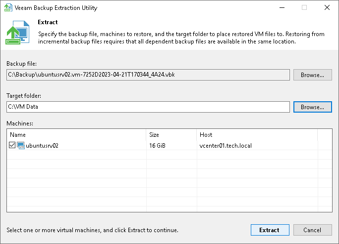

# Using Extract Utility in GUI

In this article

To restore machine data in the extract utility GUI:

1. Run the Veeam.Backup.Extractor.exe file from the installation folder of Veeam Backup & Replication.
2. In the Backup file field, specify a path to the backup file from which you want to restore machine data.
3. If the backup file is encrypted, the extract utility will require you to provide a password to unlock the backup file.
4. In the Target folder field, specify a path to the destination folder where machine data must be restored.
5. From the Machines list, select machines whose data you want to restore.
6. Click Extract. Machine data will be restored to the specified folder.

|  |
| --- |
| Important |
| If you restore machine data in the extract utility GUI, consider the following:   * The extract utility can be started on Microsoft Windows machines only. * If you plan to start the extract utility on the machine other than the backup server, make sure that you copy the Veeam.Backup.Extractor.exe file together with the extract.exe file from the product installation folder and store these files to the same folder on the destination machine. In the opposite case, the extract utility will fail to start. |

Page updated 2/20/2025

Page content applies to build 13.0.1.1071
