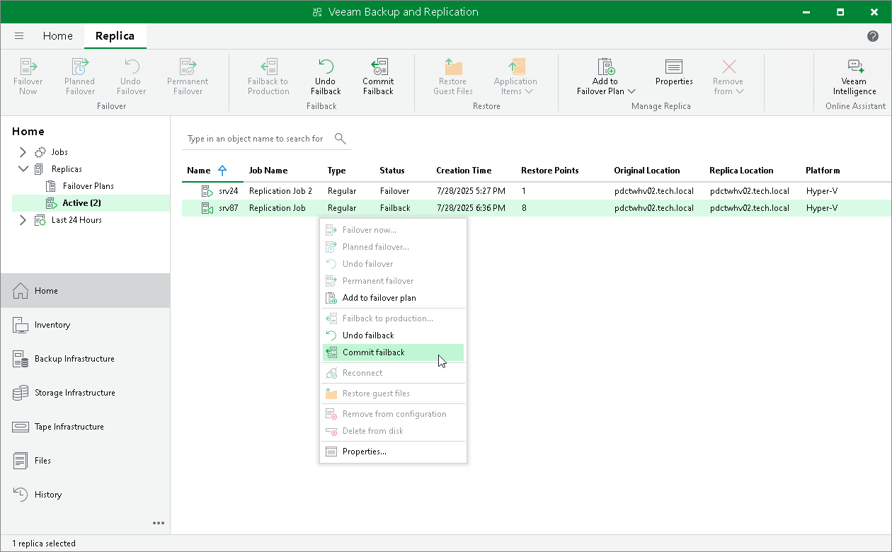

# Committing Failback

For more information on failback commit, see [Failback Commit](commit_failback_hv.md) and [Failover and Failback for Replication](failover_failback_hv.md).

To commit failback:

1. Open the Home view.
2. In the [inventory pane](vbr_ui.md), navigate to the Replicas > Active node.
3. In the working area, select the necessary replica and click Commit Failback on the ribbon. As an alternative, you can right-click the replica and select Commit failback.

