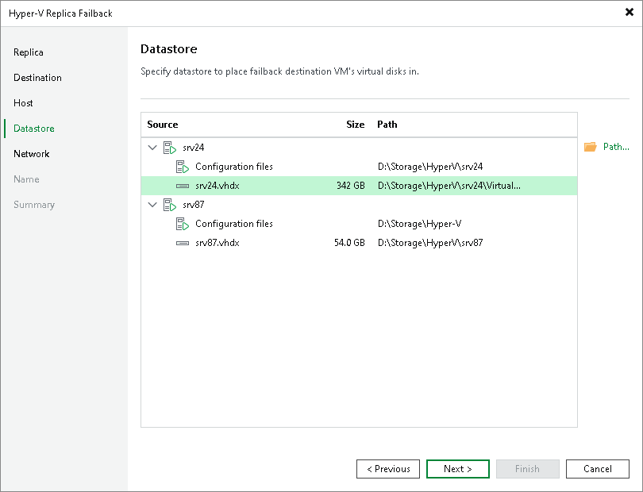

# Step 5. Select Target Datastore

The Datastore step is available if you have selected the Failback to the specified location option at the [Destination](failback_destination_hv.md) step.

When restoring a VM from a replica, you can place an entire VM to a particular location or choose to store configuration files and disk files of a restored VM in different locations:

1. If all VM files must be stored in one location, select the necessary VMs in the list.
2. If configuration and disk files of a VM should be placed to different locations, expand the VM in the list, select the necessary files.
3. Click Path.
4. In the Select Folder window, select a folder.

You can specify the following folders:

1. An existing folder on a host.
2. A new folder on a host. To do this, in the Select Folder window, select a location where the folder must be created. Click New Folder and specify a folder name.
3. A Microsoft SMB3 shared folder. To do this, in the search field at the bottom of the Select Folder window, enter a path to the Microsoft SMB3 shared folder. The path must be specified in the UNC format, for example: \\172.16.11.38\Share01.

The host or cluster where you plan to register VMs must have access to the to the Microsoft SMB3 shared folder. If you are using Microsoft SCVMM 2012 or Microsoft SCVMM 2012 R2, the server hosting the Microsoft SMB3 share must be registered in Microsoft SCVMM as a storage device. For more information, see [Microsoft Docs](http://technet.microsoft.com/en-us/library/jj614620.aspx).

