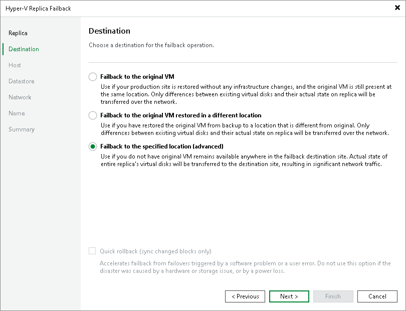

# Step 3. Select Failback Destination

At the Destination step of the wizard, select a failback destination and backup proxies for data transfer during failback:

1. Select a destination for failback. Veeam Backup & Replication supports the following options:

* Failback to the original VM — select this option if you want to fail back to the source VMs that reside on the source hosts. Veeam Backup & Replication will synchronize the state of the source VMs with the current state of their replicas to apply any changes that occurred to the replicas while running in the DR site.

If you select this option, you will proceed to the Failback Mode step of the wizard.

* Failback to the original VM restored in a different location — select this option if the source VMs have already been recovered to a new location, and you want to switch to the recovered VMs from their replicas. Veeam Backup & Replication will synchronize the state of the recovered VMs with the current state of the replicas to apply any changes that occurred to the replicas while running in the DR site.

If you select this option, you will proceed to the Target VM step of the wizard.

* Failback to the specified location — select this option if you want to recover VMs from replicas. You can recover VMs to a new location, or to any location but with different settings (such as network settings, virtual disk type, configuration file path and so on). Select this option if there is no way to fail back to the source VM or an already recovered VM.

If you select this option, the wizard will include additional steps.

If you select one of the first two options, Veeam Backup & Replication will send to the source/recovered VMs only differences between the existing virtual disks. Veeam Backup & Replication will not send replica configuration changes such as different IP address or network settings (if replica Re-IP and network mapping were applied), new hardware or virtual disks added while the replicas were in the Failover state.

If you select Failback to the specified location, Veeam Backup & Replication will send to the specified location whole VM data, including VM configurations and virtual disk content.

1. [For failback to the source VMs] If you want to fasten failback, and the source VMs had problems at the guest OS level, select the Quick rollback check box. For more information on quick rollback, its requirements and limitations, see [Quick Rollback](failback_quick_rollback_hv.md).

