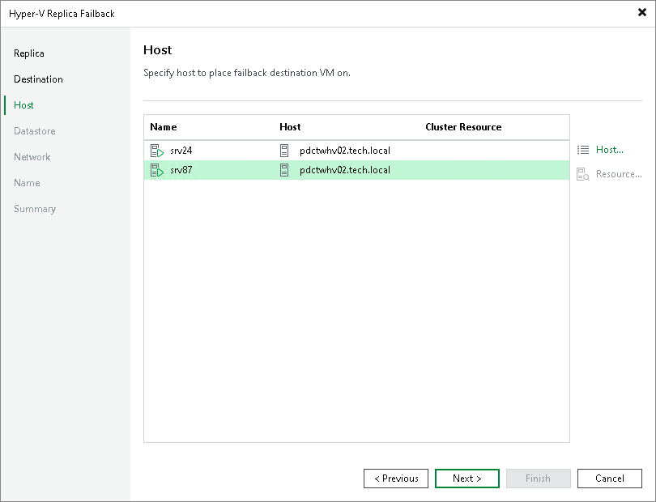

# Step 4. Select Target Host

The Host step is available if you have selected the Failback to the specified location option at the [Destination](failback_destination_hv.md) step.

To specify a target host:

1. To specify a host where the recovered VMs will be registered, select the necessary VMs and click Host. In the Select Server window, select a standalone or clustered host.

To quickly find the necessary hosts, you can use the search field at the top of the window.

1. If you choose to register a restored VM on a host that is a part of a Microsoft Hyper‑V failover cluster, you can register it as a cluster resource. To do this, select a VM in the list and click Resource. In the Cluster Resource Settings section, choose Register VM as a cluster resource. In this case, if the target host is brought offline or fails for any reason, the VM will fail over to another node in the cluster.

