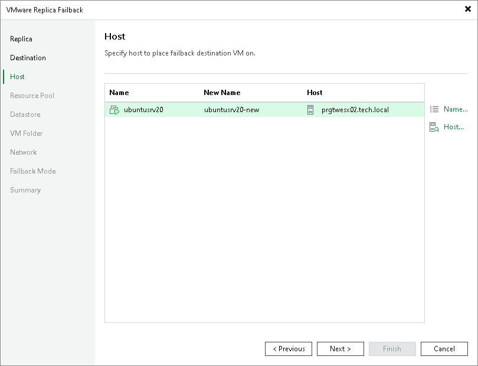

# Step 4. Select Target Host or Cluster

The Host step is available if you have selected the Failback to the specified location option at the [Destination](failback_replica_vm.md) step.

At the Host step of the wizard, specify names for the recovered VMs and hosts or clusters where the recovered VMs will be registered. To do this, select the necessary VMs and use the Host and Name buttons.

