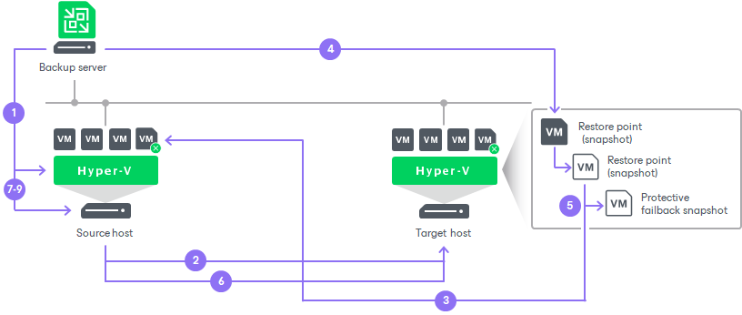

# Failback

Failback is one of the ways to finalize failover. When you perform failback, you switch back to the production VM from a VM replica, shift I/O processes from the disaster recovery site to the production site. Veeam Backup & Replication also sends all change made to the VM replica while it was in the Failover state to the production VM. However, note that these changes are only sent to the production VM but not published.

Veeam Backup & Replication provides you the following options to perform failback:

* You can fail back to the source VM in the original location.
* You can fail back to a VM already recovered to a new location. This VM must be recovered before you perform failback. For example, you can recover the VM from a backup.
* You can fail back to a VM recovered from a replica to a new location, or to any location but with different settings. The VM will be recovered from the replica during the failback process.

The first two options help you decrease recovery time and the use of the network traffic because Veeam Backup & Replication needs to transfer only differences between the source/recovered VM and VM replica. For the third option, Veeam Backup & Replication needs to transfer the whole VM data, including its configuration and virtual disk content. Use the third option if there is no way to use the source VM or restore it from a backup.

The process of failing back to the source VM or an already recovered VM differs from the process of failing back to a VM recovered from a replica:

* [How failback to the source VM and already recovered VM works](#original).
* [How failback to a VM recovered from a replica works](#replica).

How Failback to Source VM or Already Recovered VM Works

When you fail back to the source VM or an already recovered VM, Veeam Backup & Replication performs the following operations during the first phase:

1. If the production VM is running, Veeam Backup & Replication powers it off.
2. Veeam Backup & Replication creates a working failback snapshot for the production VM.
3. Veeam Backup & Replication creates a failback protective snapshot for the VM replica. You can use this snapshot to return to the pre-failback state of the VM replica afterwards.
4. Veeam Backup & Replication calculates the difference between disks of the production VM and disks of the VM replica in the Failover state. Difference calculation helps Veeam Backup & Replication understand what data needs to be transferred to the production VM to synchronize its state with the state of the VM replica.

[For VMware vSphere version prior to 7.0] If you fail back to the source VM in the original location and you have enabled the Quick rollback option, difference calculation can be performed much faster than without this option enabled. For more information on quick rollback, see [Quick Rollback](failback_quick_rollback_hv.md).

1. Veeam Backup & Replication transfers the data that was detected at the previous step to the production VM. The transferred data is written to the delta file of the working failback snapshot on the production VM.
2. Veeam Backup & Replication removes the working failback snapshot from the production VM.
3. Veeam Backup & Replication changes the state of the VM replica from Failover to Ready to switch.

During the second phase, Veeam Backup & Replication performs the following operations:

1. Veeam Backup & Replication creates a working failback snapshot on the production VM.
2. The guest OS of the VM replica is shut down or the VM replica is powered off.

If VMware Tools are installed on the VM replica, Veeam Backup & Replication tries to shut down the replica guest OS. If nothing happens after 15 minutes, Veeam Backup & Replication powers off the VM replica. If VMware Tools are not installed on the VM or the VM is suspended, Veeam Backup & Replication powers off the VM. The VM replica remains powered off until you commit failback or undo failback.

1. Veeam Backup & Replication creates a failback protective snapshot for the VM replica. The snapshot acts as a new restore point and saves the pre-failback state of the VM replica. You can use this snapshot to return to the pre-failback state of the VM replica afterwards.
2. Sends data changed on the VM replica while it was in the Ready to switch state to the working failback snapshot on the production VM.
3. Veeam Backup & Replication removes the protective snapshot from the VM replica.
4. Veeam Backup & Replication removes the working failback snapshot from the production VM. Changes written to the delta file of this snapshot are committed to the production VM disks.
5. The state of the VM replica is changed from Ready to switch to Failback. Veeam Backup & Replication temporarily puts replication activities for the production VM on hold.
6. [If you fail back to a VM already recovered to a new location] Veeam Backup & Replication updates the ID of the source VM in the Veeam Backup & Replication configuration database. The ID of the source VM is replaced with the ID of the recovered VM.
7. If you have selected to power on the production VM after failback, Veeam Backup & Replication powers on the production VM on the host.

How Failback to VM Recovered from Replica Works

If you fail back to a VM recovered from a replica, Veeam Backup & Replication performs the following operations:

1. Veeam Backup & Replication transports all VM replica files and stores them on the volume in the production site.
2. Veeam Backup & Replication registers a new VM on the production host.
3. If you have selected to power on the production VM after failback, Veeam Backup & Replication powers on the restored VM on the production host.

Finalizing Failback

Failback is an intermediate step that needs to be finalized. If the production VM works as expected and you want to get back to it, commit failback. If the VM does not work as expected, undo failback.

Related Topics

* [Performing Failback](performing_failback_hv.md)
* [Failback Commit](commit_failback_hv.md)
* [Failback Undo](undo_failback_hv.md)

