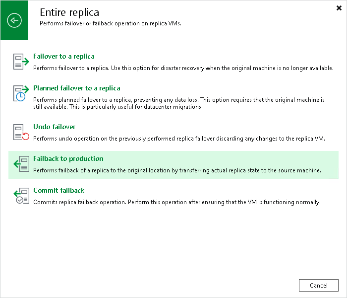

# Step 1. Launch Failback Wizard

To launch the Failback wizard, do one of the following:

* On the Home tab, click Restore > <Platform> > Restore from replica > Entire replica > Failback to production.
* Open the Home view. In the inventory pane navigate to the Replicas > Active node. In the working area, right-click the necessary replica and select Failback to production. Alternatively, click Failback to Production on the ribbon.

