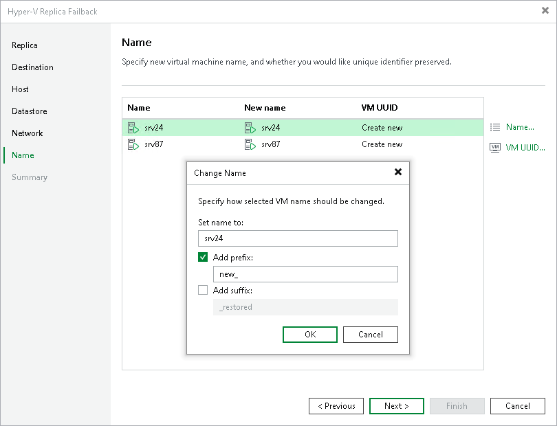

# Step 7. Specify VM Name and VM UUID Handling

In this article

The Name step is available if you have selected the Failback to the specified location option at the [Destination](failback_destination_hv.md) step.

When restoring VMs from replicas, Veeam Backup & Replication uses source VM names and creates new VM UUIDs. You can change names of the restored VMs, for example, if you restore a VM to its original location, you want to change its name to avoid confusion. You can also choose to preserve the existing VM UUID, for example, if the source VM no longer exists.

Changing VM Names

To change VM names:

1. Select one or more VMs in the list and click Name.
2. In the Change Name section, enter a new name or specify a change name rule by adding a prefix and suffix to the regular VM name.

As an alternative, you can change VM names directly in the list: select a VM, click the New name field and enter the name to be assigned to the restored VM.

Changing UUID Settings

To change VM identification settings:

1. Select one or more VMs in the list and click VM UUID.
2. In the BIOS UUID Settings window, choose one of the following options:

* Select Preserve existing VM ID if the source VM was decommissioned, so the restored VM will be used in place of the source one.
* Select Generate new VM ID if you perform VM recovery to clone the source VM. Use this option to avoid VM UUID conflicts in cases when the source VM and its duplicate will operate in parallel in the same location.

Page updated 1/25/2024

Page content applies to build 13.0.1.1071
