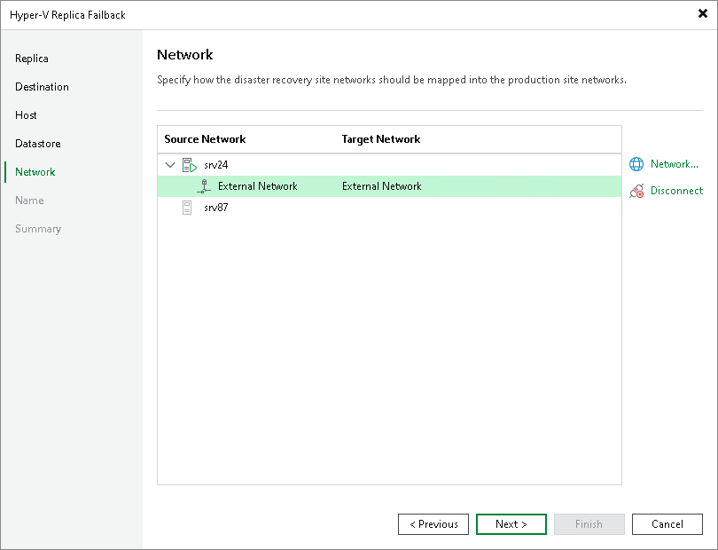

# Step 6. Select Target Network

The Network step is available if you have selected the Failback to the specified location option at the [Destination](failback_destination_hv.md) step. This step applies if you fail back to VMs recovered to new locations, and if networks in those locations differ from networks in the disaster recovery (DR) site.

At the Network step of the wizard create a network mapping table. This table maps networks in the DR site to networks in the site where the recovered VMs will reside. Veeam Backup & Replication will use the network mapping table to update configuration files of VMs on the fly, during the failback process.

To change networks to which the restored VMs will be connected:

1. In the Network connections list, select the necessary VMs and click Network.

If VMs are connected to multiple networks, select networks which you want to map.

1. In the list of available networks, select a network to which the recovered VMs will be connected.

If you do not want to connect the recovered VMs to any virtual network, select the necessary VMs and click Disconnect.

