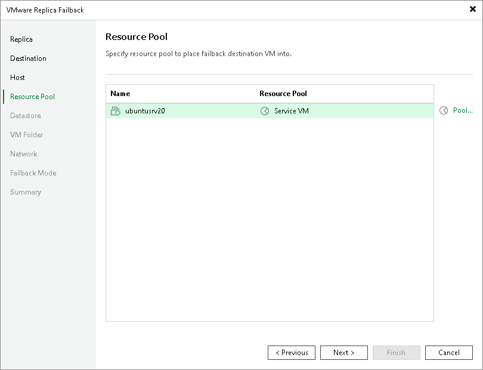

# Step 5. Select Target Resource Pool

In this article

The Resource Pool step is available if you have selected the Failback to the specified location option at the [Destination](failback_destination_vm.md) step.

At the Resource Pool step of the wizard, select resource pools to which the recovered VMs will be added. To do this, select VMs that you want to add to the same resource pool, click Pool and select the necessary resource pool in the Select Resource Pool window.

As an alternative, you can select a vApp to which the restored VM will be included. To find the necessary vApp, at the left bottom corner of the Select Resource Pool window, click the resource pool icon () and select VirtualApp.

Page updated 1/28/2025

Page content applies to build 13.0.1.1071
