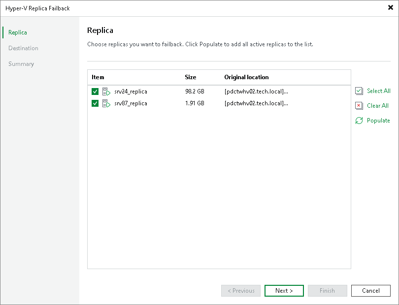

# Step 2. Select VM Replicas to Fail Back

In this article

At the Replica step of the wizard, select replicas from which you want to fail back.

To update the list of replicas that are ready for failback (replicas in the Failover state), click Populate.

Page updated 1/27/2025

Page content applies to build 13.0.1.1071
