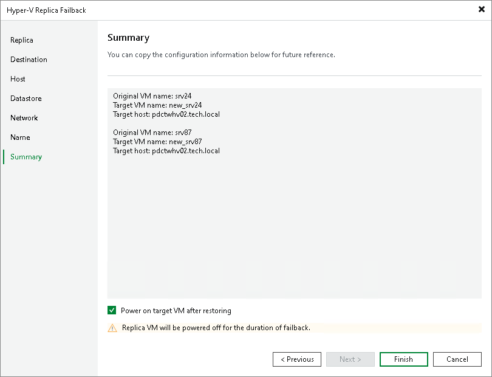

# Step 9. Review Summary and Finish Working with Wizard

At the Summary step of the wizard, review the configured failback settings and click Finish.

If you want to power on the production VMs right after the switch to production operation is performed, select the Power on target VM after restoring check box.

What You Do Next

Failback is an intermediate step that needs to be finalized. You can finalize failback in the following ways:

* [Commit failback](failback_commit_hv.md).
* [Undo failback](failback_undo_hv.md).

