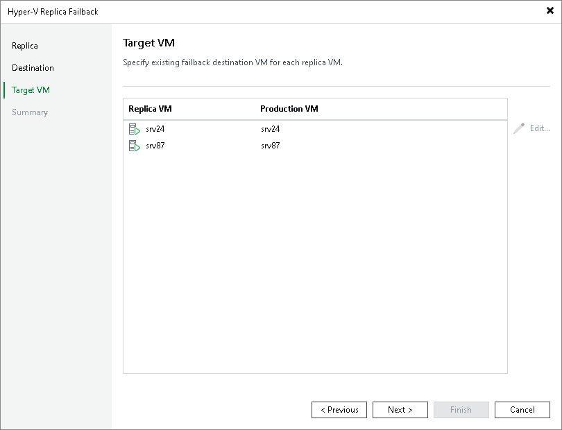

# Step 8. Map Replicas to Restored VMs

The Target VM step is available if you have selected the Failback to the original VM restored in a different location option at the [Destination](failback_destination_hv.md) step.

At the Target VM step of the wizard, specify to which VMs you want to fail back from replicas. These VMs must be already restored from backups in the required location.

