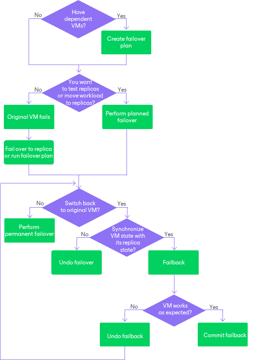

# Failover and Failback for Replication

In this article

Failover and failback operations help you ensure that your business will function even if a disaster strikes your production site. Failover is a process of switching from the VM on the source host to its VM replica on a host in the disaster recovery site. Failback is a process of returning from the VM replica to the source VM.

Veeam Backup & Replication provides the following failover and failback operations:

* Perform failover

When you perform failover, you shift all processes from the source VM in the production site to the VM replica in the disaster recovery site. During failover, changes made on the VM replica are not reflected on the source VM.

Failover is an intermediate step that needs to be finalized: you can undo failover, perform permanent failover or perform failback.

For more information on how failover is performed, see [Failover](failover.md).

* Perform planned failover

When you perform planned failover, you shift all processes from the source VM to its replica. During failover, changes made on the VM replica are not reflected on the source VM.

Planned failover is helpful when you know that the source VM is about to go offline, for example, you plan to perform datacenter maintenance, and you want to proactively switch the workload to the replica. The procedure is designed to transfer the current workload, that is why it does not suggest to select a restore point.

For more information on how planned failover is performed, see [Planned Failover](planned_failover.md).

* Create failover plan

When you create a failover plan, you define the order in which Veeam Backup & Replication must perform failover for VMs, and an interval of time for which Veeam Backup & Replication must wait before starting the failover operation for the next VM in the list.

For more information on failover plans, see [Failover Plans](failover_plan.md).

* Perform permanent failover

When you perform permanent failover, you permanently switch from the source VM to a VM replica and use this replica as the source VM.

For more information on how permanent failover is performed, see [Permanent Failover](permanent_failover.md).

* Undo failover

When you undo failover, you shift all processes back to the source VM and discard all changes made to the VM replica while it was running.

You can use the undo failover scenario if you have failed over to the VM replica for testing and troubleshooting purposes, and you do not need to synchronize the source VM state with the current state of the replica.

For more information on how failover undo is performed, see [Undoing Failover](failover_undo.md).

* Perform failback

When you perform failback, you shift all processes back to the source VM and send to the source VM all changes that took place while the VM replica was running. During failover, changes made on the source VM are not sent to the VM replica.

If the source host is not available, you can recover a VM with the same configuration as the source VM and switch to it. For more information on how failback is performed, see [Failback](failback.md).

When you perform failback, changes are only sent to the source/recovered VM but not published. You must test whether the source/recovered VM works with these changes. Depending on the test results, you can do the following:

* Commit failback. When you commit failback, you confirm that changes on the source/recovered VM work as expected and you want to get back to the source VM.

For more information on how failback commit is performed, see [Failback Commit](commit_failback.md).

* Undo failback. When you undo failback, you confirm that changes on the source/recovered VM are not working as expected and you want to discard them, and then to get back to the VM replica.

For more information on how failback undo is performed, see [Failback Undo](undo_failback.md).

Veeam Backup & Replication supports failover and failback operations for one VM and for several VMs. In case one or several hosts fail, you can use batch processing to restore operations with minimum downtime.

The following scheme can help you decide at which moment which operations are preferable.

In This Section

* [Failover Plans](failover_plan.md)
* [Failover](failover.md)
* [Permanent Failover](permanent_failover.md)
* [Planned Failover](planned_failover.md)
* [Failover Undo](undo_failover.md)
* [Failback](failback.md)
* [Failback Commit](commit_failback.md)
* [Failback Undo](undo_failback.md)

Page updated 3/19/2025

Page content applies to build 13.0.1.1071
