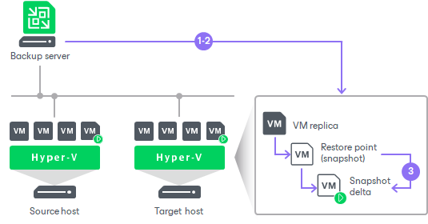

# Failover

In this article

Failover is a process when Veeam Backup & Replication switches processes from the source VM in the production site to its VM replica in the disaster recovery site. During failover, Veeam Backup & Replication recovers the VM replica to the required restore point and shifts all I/O processes from the source VM to its replica. As a result, you have a fully functional VM within a couple of seconds, and your users can access services and applications with minimum disruption.

You can fail over to replicas not only when a disaster strikes the production site, but also to test replicas for recoverability. You can perform failover while the source VM is running. After all the necessary tests, you can undo failover and get back to the normal mode of operation. If the source VMs and VM replicas are located in the same network, consider temporary disconnecting the source VMs from the network to avoid IP address or machine name conflicts.

|  |
| --- |
| Important |
| Use Veeam Backup & Replication to perform failover operations. Avoid powering on a replica manually — this may disrupt further replication operations or cause loss of important data. |

The failover operation is performed in the following way:

1. Veeam Backup & Replication rolls back the VM replica to the required restore point. To do this, Veeam Backup & Replication applies the necessary snapshot from the replica chain to the VM replica.
2. Veeam Backup & Replication powers on the VM replica. The state of the VM replica is changed from Ready to Failover.

If you perform failover for testing or DR simulation purposes, and the source VM still exists and is running, the source VM remains powered on.

|  |
| --- |
| Note |
| Veeam Backup & Replication stops all replication activities for the source VM until its replica is returned to the Ready state. |

1. All changes made to the VM replica while it is running in the Failover state are written to the differencing disk (AVHD/AVHDX) of the snapshot, or restore point, to which you have selected to roll back.

Finalizing Failover

Failover is an intermediate step that needs to be finalized. You can use one of the following operations:

* [Undo failover](undo_failover_hv.md).
* [Perform permanent failover](permanent_failover_hv.md).
* [Perform failback](failback_hv.md).

Related Topics

[Performing Failover](performing_failover_hv.md)

Page updated 1/29/2025

Page content applies to build 13.0.1.1071
