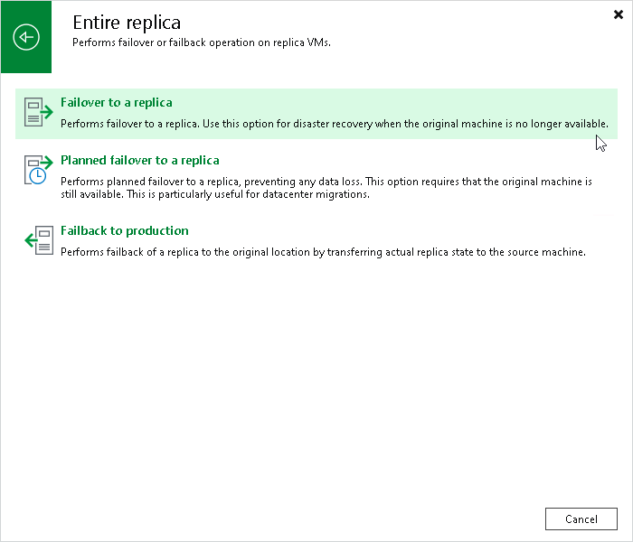

# Step 1. Launch Failover Wizard

To launch the failover wizard, do one of the following:

* On the Home tab, click Restore > <Platform> > Restore from replica > Entire replica > Failover to a replica.
* Open the Home view. In the inventory pane select Replicas > Ready. In the working area, select the necessary replica and click Failover Now on the ribbon. Alternatively, right-click the necessary replica and select Failover Now.

