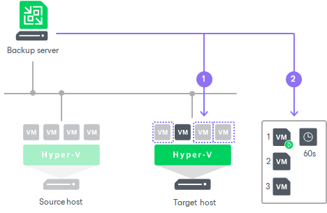

# Failover Plans

In this article

A failover plan helps you perform failover for dependent VMs one by one, as a group. To do this automatically, you can prepare a failover plan.

In the failover plan, you define the order in which VMs must be processed and an interval of time for which Veeam Backup & Replication must wait before starting the failover operation for the next VM in the list. The failover plan helps ensure that some VMs, such as a DNS server, are already running at the time the dependent VMs start.

|  |
| --- |
| Important |
| The failover plan must be created in advance. |

In case the primary VM group goes offline, you can start the failover plan manually. When you start the plan, you can choose to fail over to the latest state or select the point in time to which VM replicas must be started. Veeam Backup & Replication will look for the closest restore points to this point in time and use them to start VM replicas. The source VMs will not be powered off.

The failover process is performed in the following way:

1. For each VM, Veeam Backup & Replication detects its replica. The VMs whose replicas are already in the Failover or Failback state are skipped from processing.
2. The replica VMs are started in the order they appear in the failover plan within the set time intervals.

Limitations for Failover Plans

The maximum number of VMs that can be started simultaneously when you run a failover plan is 10. If you have added more VMs to the failover plan and scheduled them to start simultaneously, Veeam Backup & Replication will wait for the first VMs in the list to fail over and then start the failover operation for subsequent VMs. This limitation helps reduce the workload on the production infrastructure and backup server.

For example, if you have added 14 VMs to the failover plan and scheduled them to start at the same time, Veeam Backup & Replication will start the failover operation for the first 10 VMs in the list. After the 1st VM is processed, Veeam Backup & Replication will start the failover operation for the 11th VM in the list, then for the 12th VM and so on.

Finalizing Failover Plans

Failover is a temporary intermediate step that needs to be finalized. You can finalize group failover in the same ways as regular failover: undo failover, perform permanent failover or failback.

When you perform failback or permanent failover, you need to process each VM individually. For more information, see [Performing Failback](performing_failback_hv.md) and [Performing Permanent Failover](failover_permanent_hv.md). When you undo failover, you can process the whole group. For more information, see [Undoing Failover by Failover Plans](failover_plan_undo_hv.md).

Related Topics

* [Creating Failover Plans](creating_failover_plans_hv.md)
* [Running Failover Plans](running_failover_plans_hv.md)
* [Undoing Failover by Failover Plans](failover_plan_undo_hv.md)

Page updated 1/29/2025

Page content applies to build 13.0.1.1071
