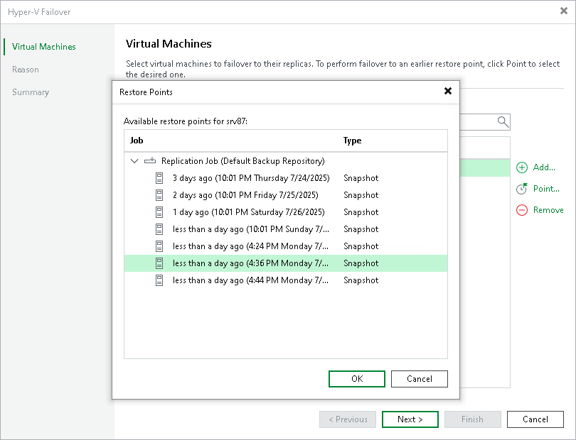

# Step 3. Select Restore Point

In this article

By default, Veeam Backup & Replication uses the latest valid restore point of the VM replica. However, you can fail over to an earlier state of the VM. If you have chosen to perform failover for several VMs, you can select the necessary restore point for every VM in the list.

To select a restore point for a VM:

1. In the Virtual machines to failover list, select the necessary VM and click Point.
2. In the Restore Points window, select the necessary restore point.

Page updated 1/24/2025

Page content applies to build 13.0.1.1071
