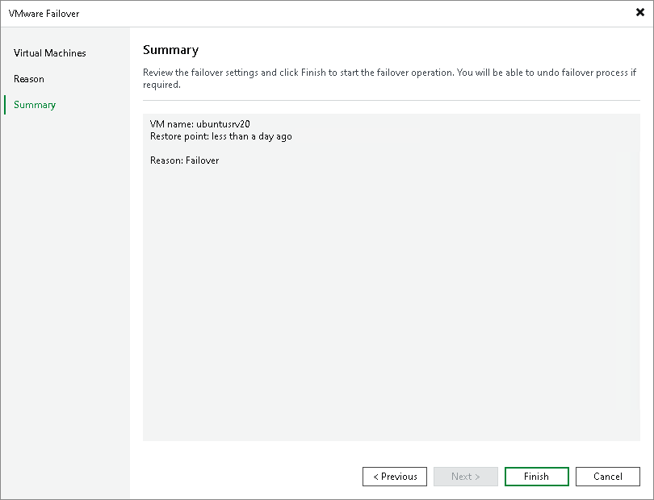

# Step 5. Finish Working with Wizard

In this article

At the Summary step of the wizard, review details of the failover task and click Finish to exit the wizard. When the failover process is complete, the VM replicas will be started on the target host.

What You Do Next

Failover is an intermediate step that needs to be finalized. You can finalize failover in the following ways:

* [Perform permanent failover](failover_permanent.md).
* [Undo failover](failover_undo.md).
* [Perform failback](performing_failback.md).

Page updated 8/18/2025

Page content applies to build 13.0.1.1071
