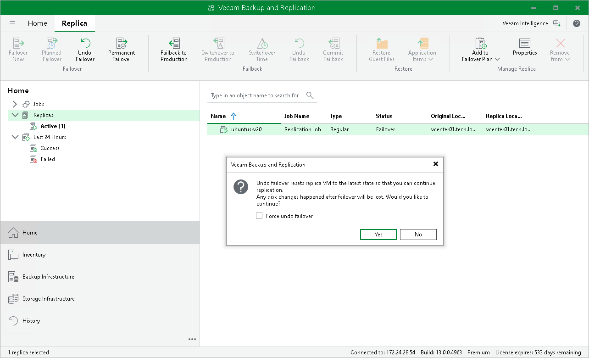

# Undoing Failover

For more information on failover undo, see [Failover Undo](undo_failover.md) and [Failover and Failback for Replication](failover_failback.md).

To undo failover:

1. Open the Home view.
2. In the inventory pane, navigate to the Replicas > Active node.
3. In the working area, select the necessary replica and click Undo Failover on the ribbon. As an alternative, right-click one of the selected replicas and click Undo failover.
4. In the displayed window, do the following:

1. If you want to force failover undo, select the Force undo failover check box.

When you force failover undo, Veeam Backup & Replication attempts to perform the failover undo operation in a regular way. If the host on which the VM replica resides is unavailable, Veeam Backup & Replication changes the VM replica state to Ready in the configuration database and console. This helps avoid failure of the failover undo operation.

1. Click Yes.

