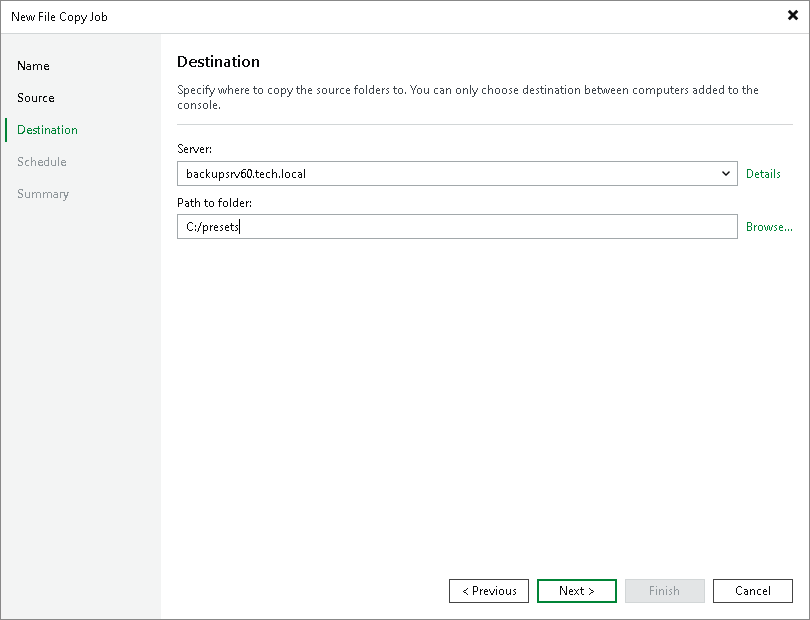

# Step 4. Select Destination for Copying

At the Destination step of the wizard, select the destination to which files or folders must be copied.

To specify the destination:

1. From the Server list, select the target host or server.
2. Click Details next to the Server field to view or edit server properties.
3. Click Browse next to the Path to folder field and select the folder where the copied items must be stored. To create a dedicated folder for the copied files or folders, click the New Folder button at the bottom of the Specify Folder window.

|  |
| --- |
| Important |
| Consider the following:   * If the target folder already contains files or folders with the same names and extensions as the files or folders that must be copied, Veeam Backup & Replication will replace files or folders in the target folder with new ones. * You cannot use a backup server as a destination for file copy jobs. |

