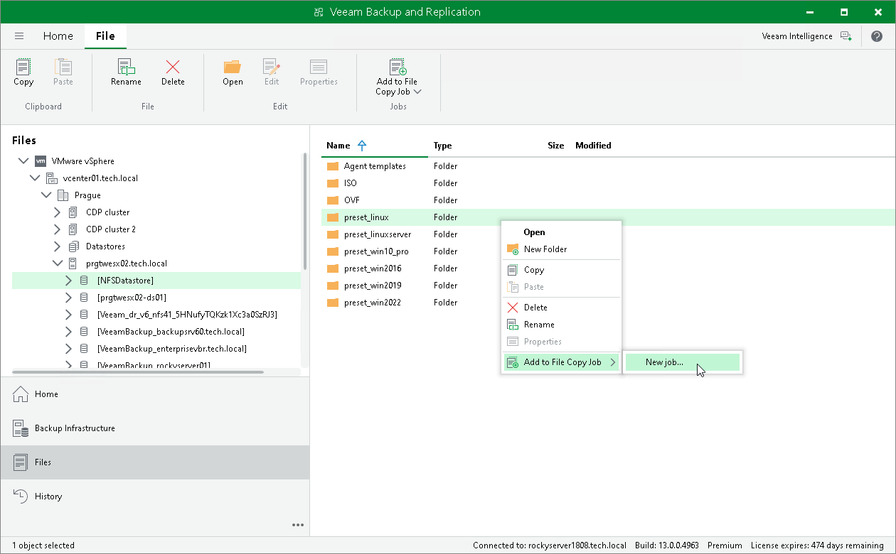

# Step 1. Launch New File Copy Job Wizard

To launch the New File Copy Job wizard, do either of the following:

* On the Home tab, click Copy Job > File.
* Open the Files view. In the working area, right-click the necessary files and folders and select Add to File Copy Job > New job. Veeam Backup & Replication will start the New File Copy Job wizard and add selected files and folders to this job. You can add other files and folders to the job later on, when you pass through the wizard steps.

You can add files and folders to already existing jobs. To do this, open the Files view. In the working area, right-click the necessary objects and select Add to File Copy Job > Name of the job.

