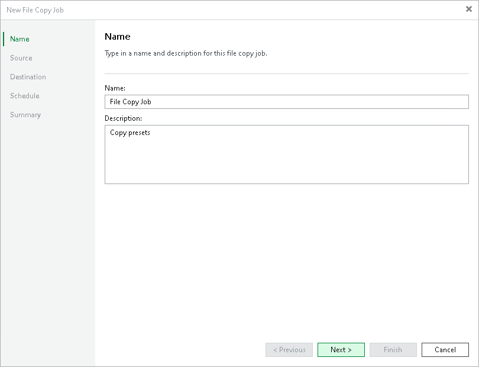

# Step 2. Specify Job Name and Description

At the Name step of the wizard, enter a name and description of the created job.

1. In the Name field, enter a name for the file copy job.
2. In the Description field, provide a description for future reference. The default description contains information about the user who created the job, as well as the date and time when the job was created.

