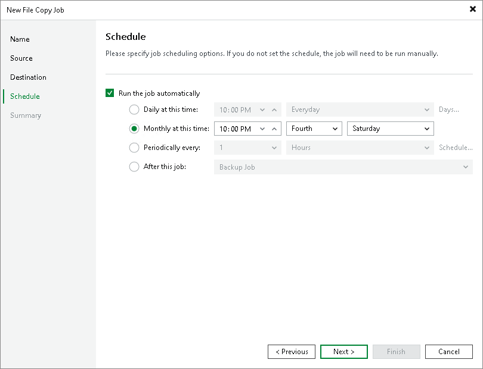

# Step 5. Define Job Schedule

In this article

At the Schedule step of the wizard, you can choose to run the file copy job manually or schedule it to run regularly.

To specify the job schedule:

1. Select the Run the job automatically check box. If you do not select this check box, you will have to start the job manually to copy files or folders.
2. Define the scheduling settings for the job:

+ To run the job at a specific time daily, on selected weekdays, or with specific periodicity, select the Daily at this time option. Use the fields on the right to configure the schedule.
+ To run the job once a month on specific days, select the Monthly at this time option. Use the fields on the right to configure the schedule.

|  |
| --- |
| Note |
| When you configure the job schedule, consider possible changes in date and time, such as those related to daylight saving time transition. |

* To run the job repeatedly throughout the day with a set time interval, select the Periodically every option. In the field on the right, select the time unit: Hours or Minutes. Click Schedule and use the timetable to define the permitted time window for the job. In the Start time within an hour field, specify the exact time when the job must start.

A repeatedly run job is started by the following rules:

+ Veeam Backup & Replication always starts counting defined intervals from 12:00 AM. For example, if you configure to run a job with a 4-hour interval, the job will start at 12:00 AM, 4:00 AM, 8:00 AM, 12:00 PM, 4:00 PM, and so on.
+ If you define permitted hours for the job, after the denied interval is over, Veeam Backup & Replication will immediately start the job and then run the job by the defined schedule.

For example, if you configure a job to run with a 2-hour interval and define permitted hours from 9:00 AM to 5:00 PM, the job will first run at 9:00 AM when the denied period is over. After that, the job will run at 10:00 AM, 12:00 PM, 2:00 PM and 4:00 PM.

+ To run the job continuously, select the Periodically every option and choose Continuously from the list on the right.
+ To chain jobs, use the After this job field. In the common practice, jobs start one after another: when job A finishes, job B starts, and so on. To create a chain of jobs, define the time schedule for the first job in the chain. For each subsequent job in the chain, at the Schedule step of the wizard, select the After this job option and choose the preceding job from the list.

Page updated 12/2/2025

Page content applies to build 13.0.1.1071
