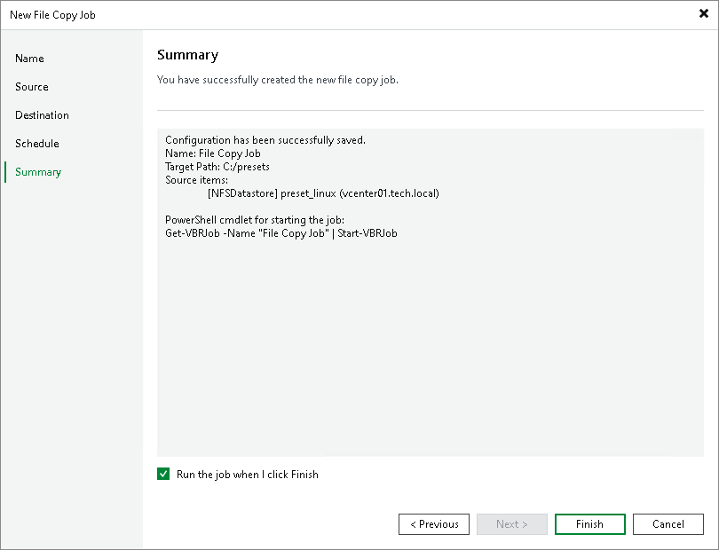

# Step 6. Finish Working with Wizard

At the Summary step of the wizard, complete the file copy job configuration.

1. Review the details of the created file copy job.
2. Select the Run the job when I click Finish check box to start the job right after you finish working with the wizard.
3. Click Finish to close the wizard.

