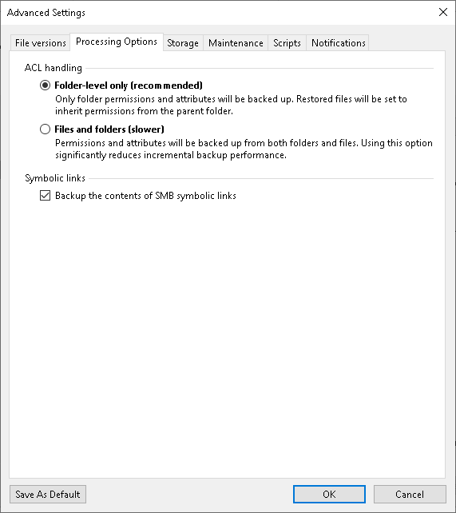

# ACL Handling Settings

In this article

To specify how the backup job will process permissions and attributes:

1. At the Backup Repository step of the wizard, click Advanced.
2. On the ACL Handling tab, specify how the backup job will process permissions and attributes:

* Select Folder-level only (recommended) to back up permissions and attributes from folders only. The restored files will inherit permissions from the target folder.
* Select Files and folders (slower) to back up permissions and attributes from both folders and individual files. This option can significantly reduce the backup performance.

If you change the ACL handling settings for an existing file backup job, Veeam Backup & Replication will create a full backup file during the next job session.

1. If necessary, select the Backup the contents of SMB symbolic links check box.
2. If you want to save this set of settings as the default one, click Save as default. When you create a new job, the saved settings will be offered as the default. This also applies to all users added to the backup server.

|  |
| --- |
| Note |
| Consider that Veeam Backup & Replication does not collect ACL handling settings of the source file share root folder, so you cannot restore them. Before restoring an entire file share, you will have to specify required ACL handling settings for the root folder of the target file share. |

Page updated 9/3/2025

Page content applies to build 13.0.1.1071
