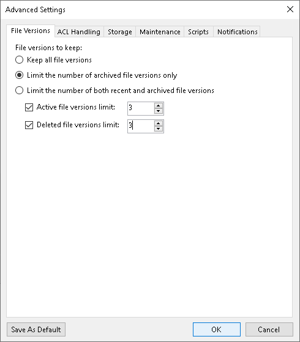

# File Version Settings

To configure how many file versions to keep for protected files, do the following:

1. At the Backup Repository step of the wizard, click Advanced.
2. On the File Versions tab, specify to what file versions the settings should apply:

* Select Keep all file versions to keep all file versions for the time period specified in the main window at the Storage step.
* Select Limit the number of archived file versions only to limit archived file versions to the numbers specified to the right of the Active file versions limit and Deleted file versions limit check boxes.
* Select Limit the number of both recent and archived file versions to limit recent and archived file versions to the numbers specified to the right of the Active file versions limit and Deleted file versions limit check boxes.

1. After you choose what file versions to keep, specify how many file versions to keep:

* Select Active file versions limit to keep the specified number of versions for files currently existing in the source file share. Specify how many file versions to store.
* Select Deleted file versions limit to keep the specified number of versions for files deleted from the source file share. Specify how many file versions to store.

1. If you want to save this set of settings as the default one, click Save as default. When you create a new job, the saved settings will be offered as the default. This also applies to all users added to the backup server.

