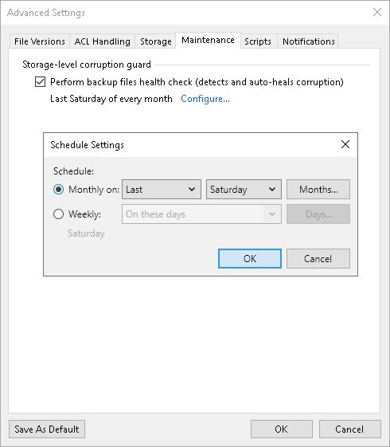

# Maintenance Settings

You can instruct Veeam Backup & Replication to periodically perform a health check for the backup. The health check helps make sure that the backup is consistent, and you will be able to restore data from it.

During the health check, Veeam Backup & Replication performs a CRC check for metadata and a hash check for data blocks in the file share backup files to verify their integrity. For more information, see the [Performing Health Check and Repair for Unstructured Data Backups](unstructured_data_backup_health_check.md) section.

To configure the health-check settings for the backup job:

1. At the Backup Repository step of the wizard, click Advanced.
2. On the Maintenance tab, select Perform backup files health check to enable the health check option. It allows ensuring that all data and metadata is backed up correctly.
3. Click Configure and specify the time schedule for the health check.
4. If you want to save this set of settings as the default one, click Save as default. When you create a new job, the saved settings will be offered as the default. This also applies to all users added to the backup server.

