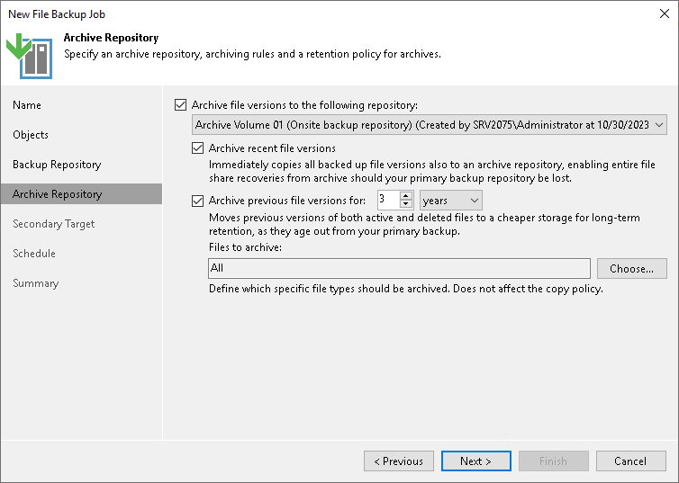

# Step 6. Specify Archive Repository Settings

At the Archive Repository step of the wizard, define the archive repository, where the file backup job must store backup files, and settings for moving or copying files and folders to this repository. To learn what storage types you can assign the role of the archive repository to, see [Storage Repositories](unstructured_data_backup_infrastructure.md#backup_repository) in the Backup Infrastructure for Unstructured Data Backup section.

1. If you need to keep versions of some files for a longer time after they are moved from the backup repository, you can configure archiving options to move files versions to the archive repository. You can also copy the recent file versions to the archive repository to store them according to the backup repository retention policy.

To use the archive repository, select the Archive file versions to the following archive repository check box.

1. From the drop-down list under the Archive file versions to the following archive repository check box, select the storage to be used as a repository to store archived files and folders.

By default, all files deleted from the backup repository will be moved to the archive repository. If you do not need all the files in the archive, you can choose what files to keep.

|  |
| --- |
| Note |
| If you plan to store backups in [Veeam Data Cloud Vault](osr_adding_veeam_data_cloud_vault.md), you must enable encryption for file backup jobs. |

1. If you need to keep the copy of the data stored in the backup repository also in the archive repository, select the Archive recent file versions check box.

When you archive the recent file versions, Veeam Backup & Replication immediately copies all backed up files from backup repository to the archive repository and stores them according to the backup repository retention policy. For example, if backup repository is configured to store file versions for 20 days, archive repository will also store these file versions for 20 days.

|  |
| --- |
| Note |
| Consider the following:   * The copy mode in unstructured data backup requires a license. Thus, this feature is not supported in the Veeam Backup & Replication Community (free) Edition. For details, see [Veeam Editions Comparison](https://www.veeam.com/backup-version-standard-enterprise-editions-comparison.html). * If you use a backup repository with immutability enabled as an archive repository with the Archive recent file versions option, the immutability settings of the archive repository affect the retention behavior of the primary backup repository. For example, if the primary backup repository is a Windows host (that does not support immutability), and the archive repository is an S3 compatible object storage repository with 14 days of immutability, the backed-up data would be "logically" locked by the archive repository immutability for at least 14 days before retaining it. |

1. To specify the number of months or years during which backup files must be retained, select the Archive previous file versions for check box and specify the period.

The period setting denotes a time period starting from the creation of the backup files in the backup repository, not from the moment when the file versions are moved from the backup repository to the archive repository.

When you archive the previous file versions, Veeam Backup & Replication moves backup and metadata files after their retention period is over from backup repository to the archive repository and stores them according to the archive repository retention policy. For example, if backup repository is configured to store backup files versions for 20 days, Veeam Backup & Replication moves backup files to the archive repository on the 21 day.

1. To specify what files must be archived or excluded from the archive, do the following:

1. Click Choose to open the File Archive Settings window.
2. Under Files to archive, specify what files must be archived:

* All files — select this option to archive all files moved from the backup repository to the archive repository.
* All files except the following extensions — select this option to exclude files with certain extensions from the selection to be archived. Specify extensions for files to exclude from the selection. Files with the specified extensions will not be copied from the backup repository to the archive repository.
* Files with the following extensions only — select this option to archive files with certain extensions only. Specify extensions for files to archive. Files with these extensions will be copied from the backup repository to the archive repository.

