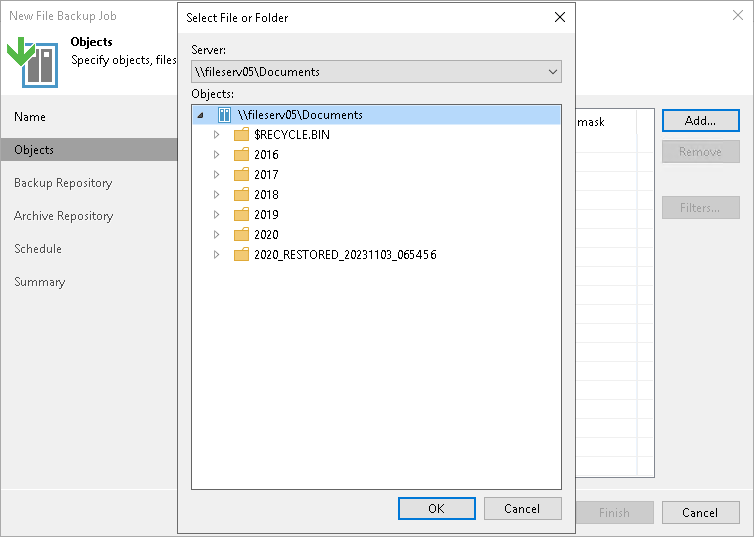
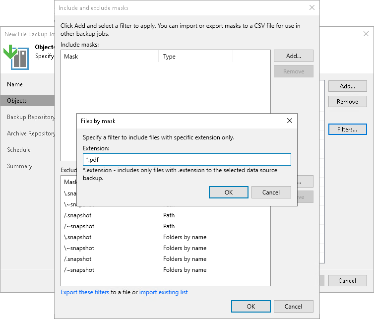
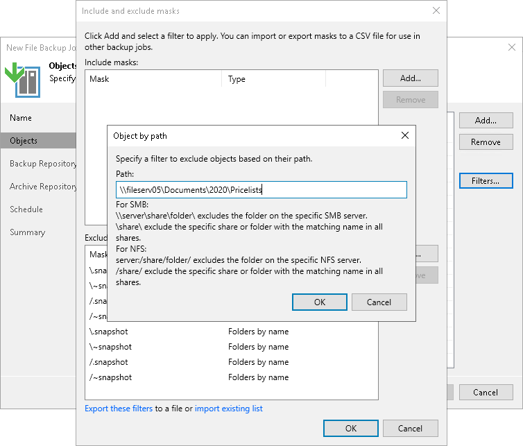

# Step 3. Select Files and Folders to Back Up

In this article

At the Objects step of the wizard, select files and folders that you want to back up.

1. Click Add.
2. From the Server list, select a file share on which the necessary files or folders reside.

|  |
| --- |
| Note |
| If you plan to protect file shares residing on the enterprise storage system, you can choose between two different approaches. For more information, see the [File Backup Integration with Storage Systems](storage_snapshot_integration.md) section. |

1. In the Objects tree, select folders you want to back up.

|  |
| --- |
| Note |
| If you select a NAS filer from the Server list, but the Objects tree is empty, make sure that the storage system rescan was performed and finished. For more information about the storage system rescan process, see [Storage Discovery Process](storage_discovery_process.md) section. |

To select multiple folders, hold [Ctrl] and click necessary folders. Although different folders of the same share form separate records in the table, they will be processed by one job task.

Consider the following:

* Hard links in file shares are protected with content included.
* Symbolic links in file shares are protected as links, without the content they refer to.

1. If you add a folder to the job, all the folder contents will be processed.

If necessary, you can choose only specific files from the added folder.

Including Objects

To filter objects that you want to back up, you can specify the object name or extension mask to include into processing.

1. Select an object in the Objects list and click Filters.
2. In the Include and exclude masks window, use the Include masks section to include objects.
3. Click Add.
4. In the Files by mask window, specify the value associated with the object. For example:

* To backup only PDF files, enter \*.PDF in the Extension field and click OK.
* To backup all files with name sales\_report.xlsx, enter sales\_report.xlsx in the Extension field and click OK.

1. Click OK.

Excluding Objects

To filter objects that you do not want to back up, you can specify the path or file mask to exclude from processing.

1. Select an object in the Objects list and click Filters.
2. In the Include and exclude masks window, use the Exclude masks field to exclude objects.
3. Click Add.
4. Depending on the way you want to exclude objects, select one of the following:

* To exclude object by path, select Object by path and specify a filter to exclude objects based on their path.

|  |
| --- |
| Note |
| Wildcards are not supported. |

* To exclude files by mask, click Files by mask and specify a filter to exclude files with specific extension.
* To exclude multiple objects by path, click Multiple Objects by Path and specify a filter to exclude folder with the matching name.

For example:

* To exclude PDF files from processing, select the Files by mask option, enter \*.PDF in the Extension field and click OK.
* To exclude all files with name pricelist.xlsx from processing, select the Files by mask option, enter pricelist.xlsx in the Extension field and click OK.
* To exclude the folder from processing, select the Multiple Objects by Path option, enter \folder for SMB shares or /folder for NFS shares, and click OK.
* To exclude folder 2016 from processing, select the Object by path option, enter the full path to it in the Path field and click OK. For example, for an NFS file share this path looks like: QA04:/NFS04/Documents/2016, for an SMB file share — \\fileserv05\Documents\2016).

Alternatively, you can specify a relative path to the folder or file to exclude. In case of the NAS filer, this is the only option to specify a path to exclude. For example, to exclude folders call\_records (where call records are located) from all file shares residing on the NAS filer, in the Path field of the Object by path window, specify /call\_records (this mask will exclude the call\_records folder from processing for all NFS file shares on this NAS filer) and \call\_records (this mask will exclude the call\_records folder from processing for all SMB file shares on this NAS filer) and click OK.

You can exclude a whole file share from processing. For example, you add the \\Server\ SMB server to the file backup job, but you want to exclude the \\Server\Sharing file share from processing. To exclude this file share from processing, in the Path field of the Object by path window, enter the \\Server\Sharing path and click OK. The job will back up all file shares that Veeam Backup & Replication detects on this server, but will skip the excluded file share.

|  |
| --- |
| Note |
| Consider the following:   * Include and exclude masks are case insensitive. * You cannot exclude a whole file share from processing if the storage system, where file shares reside, is added to Veeam Backup & Replication as a NAS filer.   As a workaround, you can edit the storage in Storage Infrastructure and exclude the volumes on the NAS Filer step, as described in the [Adding NetApp Data ONTAP](netapp_nas_access.md), [Adding Lenovo ThinkSystem DM/DG Series](specify_nas_access.md), [Adding Dell PowerScale (formerly Isilon)](dell_powerscale_add_options.md) or [Adding Nutanix Files Storage](nutanix_add_nas.md) sections, depending on the type of the storage system you use.   * You cannot use mask with \* to specify folders to exclude from processing. For example, mask QA04:/NFS04/Documents/201\* will not work. * You cannot mix different exclusion options, for example, you cannot use a mask to exclude files with certain extensions from the specific folder. For example, QA04:/NFS04/Documents/2016/\*.xlsx will not work. |

|  |
| --- |
| Tip |
| You can follow this set of examples for specifying the path in the Object by path window:   * For SMB shares:  * \\server\share\folder\ includes/excludes the folder on the specific SMB server. * \share includes/excludes all shares with the matching name. * \share\folder includes/excludes only the specific folder in all shares with the matching name.  * For NFS shares:  * server:/share/folder/ includes/excludes the folder on the specific NFS server. * /share/ includes/excludes all shares with the matching name. * /share/folder/ includes/excludes only the specific folder in all shares with the matching name. |

Exporting and Importing Filters

If necessary, you can export and import your masks:

* To export a mask to a file, click the Export these filters link. In the Export to file window, specify a path to the necessary XML file. Click OK.
* To import existing masks from a file, click the Import existing list link. In the Import masks from file window, specify a path to the necessary XML file. Click OK.

Page updated 4/16/2025

Page content applies to build 13.0.1.1071
